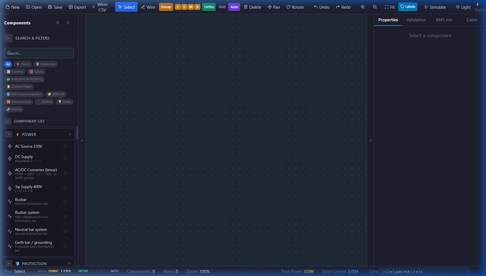

<p align="center">
  
</p>

<h1 align="center">⚡ ElectroSim</h1>

<p align="center">
  <strong>A professional-grade desktop electrical schematic editor and real-time circuit simulator.</strong><br />
  Design, simulate, and validate low-voltage power distribution, motor starters, BMS control panels,<br />
  and protection coordination — all in one application.
</p>

<p align="center">
  
  
  
  
  
  
</p>

---

## What Is ElectroSim?

ElectroSim is a **desktop application** for designing electrical control schematics and simulating them in real time. Unlike generic circuit simulators, it focuses on **industrial low-voltage systems** — the kind of panels that electrical engineers design every day: motor starters, breaker coordination, BMS integration, and power distribution boards.

Drop components onto a canvas, wire them together, and watch the simulator propagate voltages, detect faults, calculate load currents, and validate your design — all instantly.

---

## ✨ Key Features

### 🔌 Schematic Editor
- **CAD-style canvas** with infinite pan/zoom, grid snapping, and orthogonal wiring (F8 Ortho, F3 OSnap, F9 Grid)
- **AutoCAD-inspired wire tools** — break, trim, extend, segment editing, and T-junction splicing
- **Wire style layers** — power AC/DC, control AC/DC, earth/PE, neutral, communication, and instrumentation
- **Wire schedule export** — CSV download of all wire designators, endpoints, and cross-sections
- Drag-and-drop from a categorized component sidebar with **search and filters**
- Undo/Redo with full circuit state history
- Save/Load circuits as JSON — Open and continue any previous design
- Dark and Light themes

### ⚡ Real-Time Simulation Engine
- **Fixpoint potential propagation** — voltages flow from sources through closed switches, breakers, and contactors
- **Load current calculation** — resistive, inductive, and capacitive loads with configurable power factor
- **Fault detection** — overload, short circuit, earth fault, and arc fault detection with automatic breaker tripping
- **Three-phase simulation** — balanced and **unbalanced** wye loads with per-phase current factors, power factors, and voltage factors
- **Neutral current computation** — phasor-sum I_N for unbalanced three-phase loads
- **Multimeter probe** — voltage, current, and continuity modes with AC/DC signal detection

### 🛡️ Circuit Validation Panel
Static design checks that catch errors **before** you rely on the simulation:
- Missing neutral or earth connections
- Unprotected feeders (load without upstream breaker)
- Phase system mismatches (single-phase load on three-phase feeder)
- BMS control readiness (UVR, spring charge, control voltage interlocks)
- Communication address conflicts (duplicate Modbus/BACnet addresses)
- Cable vs. breaker current rating mismatches
- Three-phase motor imbalance warnings (configurable threshold)

### 🏗️ Protection Coordination
- Automatic **feeder-order analysis** — devices sorted by electrical distance (hops) from the supply
- Trip curve and rating comparison table for upstream/downstream grading
- Click-to-select navigation from validation issues to the schematic

### 🖥️ BMS Simulator Panel
Interactive Building Management System simulation:
- **ACB (Air Circuit Breaker)** — closing coil pulse, shunt trip, UVR interlock, spring charge interlock
- **Motorized MCCB** — motor close pulse, shunt trip, control voltage interlock, mechanism ready check
- Full **command audit log** with timestamped pass/fail results and interlock explanations
- Per-device and global log clearing

### 📐 Cable Sizing Wizard
- Input load power, distance, and installation method
- Automatic cross-section calculation based on ampacity and voltage drop limits
- Direct update of wire properties in the schematic

---

## 🧩 Supported Components

ElectroSim ships with **80+ electrical components** across 10 categories:

| Category | Components |
|---|---|
| **Power** | AC Source 230V, DC Supply, AC/DC Converter, 3φ Supply 400V, SMPS, Control Transformer, Busbar / Busbar System, Neutral Bar, Earth Bar |
| **Protection** | MCB (B/C/D curves), 3P MCB, 4P MCB, MCCB, Motor Protection Circuit Breaker (MPCB), Air Circuit Breaker (ACB), HRC Fuse, Control Circuit Fuse, RCD / RCCB, Earth Leakage Relay (CBCT) |
| **Controls** | Contactor, 3φ Contactor, 4φ Contactor, Relay, Smart Relay, Interposing Relay, Timer Relay, Overload Relay, Aux Contact Block, Push Button (NO/NC), E-Stop, Selector Switch (3-pos) |
| **Safety** | Door Interlock, Mechanical Interlock, Key Interlock, E-Stop |
| **Indicators & Metering** | Indicator Lamp (multi-color), Phase Indicator Bank, Energy Meter, Digital Multifunction Meter, Power Quality Analyzer, Multimeter, Current Transformer, Voltage Transformer |
| **Control Power** | SMPS, AC/DC Converter (linear), Control Transformer, UPS Module, DC Battery Backup |
| **BMS Communication** | Modbus TCP Gateway, Modbus RTU Module, BACnet/IP Gateway, Communication Converter, IoT Gateway, Cloud Monitoring Module, Energy Management Controller, Ethernet Switch |
| **BMS I/O** | DI Module, DO Module, AI Module (0-10V / 4-20mA), AO Module, Relay Interface Card, Signal Isolator, Optocoupler Module |
| **Loads** | Generic Load, Lamp, Motor, 3φ Motor, Heater, Panel Heater, Cooling Fan, Socket |
| **Infrastructure** | DIN Rail, Mounting Plate, Cable Duct, Busbar Support Insulator, Ferrule/Cable Markers, MS/GI Sheet Enclosure, IP-Rated Enclosure, Neutral Link, Earth Link, Terminal Block, Junction |

---

## 🚀 Getting Started

### Prerequisites

- **Node.js** ≥ 20
- **npm** ≥ 10

### Development (Web)

```bash
# Clone the repository
git clone <repo-url>
cd Electroism

# Install dependencies
npm install

# Start the Vite dev server (browser only)
npm run dev
```

Open [http://localhost:5173](http://localhost:5173) in your browser.

### Development (Electron Desktop)

```bash
# Start both Vite and Electron concurrently
npm run dev:electron
```

### Production Build

```bash
# Type-check + Vite production bundle
npm run build

# Build the Windows desktop installer (.exe via electron-builder)
npm run build:desktop
```

The installer is output to the `release/` directory.

---

## 🛠️ Tech Stack

| Layer | Technology |
|---|---|
| **UI Framework** | React 19 + TypeScript |
| **Canvas** | Konva / react-konva (GPU-accelerated 2D) |
| **State Management** | Zustand 5 (modular slices) |
| **Styling** | Tailwind CSS 3 |
| **Bundler** | Vite 8 |
| **Desktop Shell** | Electron 41 |
| **Desktop Packaging** | electron-builder (NSIS) |
| **Math** | math.js (phasor arithmetic) |
| **Linting** | ESLint + typescript-eslint |

---

## 📁 Project Structure

```
src/
├── components/
│   ├── Canvas/         # Konva canvas, grid, component renderers
│   ├── Panels/         # PropertyPanel, Validation, BMS Sim, Cable Sizing, Sidebar
│   ├── Toolbar/        # Top toolbar (tools, snap toggles, zoom)
│   ├── Dialogs/        # Fault dialogs, confirmations
│   └── Audio/          # Continuity buzzer
├── simulation/
│   ├── engine.ts       # Coordinator — fixpoint loop orchestration
│   ├── terminalGraph.ts    # Terminal adjacency graph builder
│   ├── potentials.ts       # Voltage propagation & load current
│   ├── faultDetection.ts   # Overload, short circuit, earth fault logic
│   ├── threePhaseCalc.ts   # 3φ phasor math & unbalanced loads
│   └── engineTypes.ts      # Shared types & graph primitives
├── store/
│   ├── circuitStore.ts     # Main Zustand store
│   ├── slices/             # Modular action slices (component, BMS)
│   └── themeStore.ts       # Dark/light theme
├── types/              # TypeScript interfaces (Circuit, Component, Wire, etc.)
└── utils/              # Validation, cable sizing, wire helpers
```

---

## 📜 Scripts Reference

| Script | Description |
|---|---|
| `npm run dev` | Start Vite dev server (browser) |
| `npm run dev:electron` | Start Vite + Electron concurrently |
| `npm run build` | TypeScript check + Vite production build |
| `npm run build:desktop` | Full production build + Windows installer |
| `npm run lint` | Run ESLint across the project |
| `npm run preview` | Preview the production build locally |

---

## 📸 Screenshots

<p align="center">
  
  <br />
  <em>Main interface — dark theme with component sidebar, CAD canvas, and property inspector</em>
</p>

---

## 🗺️ Roadmap

- [ ] Unit tests for the simulation engine (Vitest)
- [ ] Example circuit files (DOL starter, ACB incomer, BMS IO panel)
- [ ] Time-Current Curve (TCC) plotter for visual protection coordination
- [ ] Transient / oscilloscope view for motor starting inrush
- [ ] Short-circuit and arc flash calculations
- [ ] Component grouping / macros for reusable sub-circuits
- [ ] 2D panel layout generator (DIN rail arrangement)
- [ ] Learning mode with plain-language fault explanations

---

## 👤 Author

**PSYCHOTIC**

---

<p align="center">
  <sub>Built with ⚡ for electrical engineers who think in schematics.</sub>
</p>
